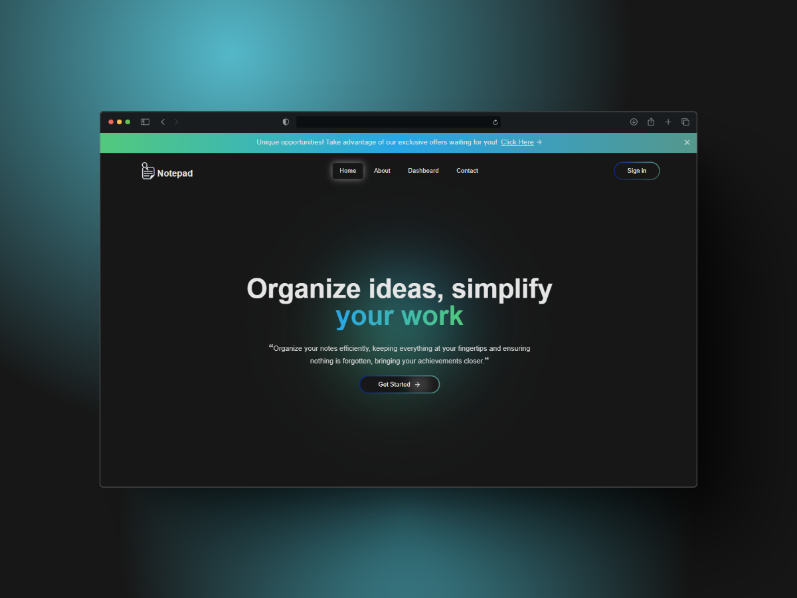

<p align="center">
   
</p>

<h1 align="center">
    <a href="#">Notepad</a>
</h1>

<p align="center">
    Notepad is a web application designed for creating and managing notes, featuring rich text editing, image selection, and seamless storage integration.
</p>

<p align="center">
  <a href="https://github.com/rafael-bit/notepad">
  	
  </a>
</p>

# 🚀 How It Works

Notepad allows users to create, edit, and manage notes with features like rich text editing using TipTap, automatic content saving after inactivity, and image selection from a gallery.

## 👷 Running Locally

#### Clone the repository

```bash
git clone https://github.com/rafael-bit/notepad
```

#### Install dependencies and run the application in development mode

```bash
yarn
yarn dev
```

Open this address in your browser: [Notepad](http://localhost:3000/)

# 💻 Technologies

- [Next.js](https://nextjs.org/)
- [TypeScript](https://www.typescriptlang.org/)
- [Tailwind CSS](https://tailwindcss.com/)
- [Shadcn](https://ui.shadcn.com/)
- [TipTap](https://tiptap.dev/)
- [Drizzle ORM](https://orm.drizzle.team/)
- [Neon Database](https://neon.tech/)
- [Clerk](https://clerk.dev/)
- [React Query](https://tanstack.com/query/latest)
- [Lucide React](https://lucide.dev/)
- [Axios](https://axios-http.com/)

# 🚩 Bugs

Feel free to **report a new issue** with an appropriate title and description.

# 💡 Author

- Rafael Áquila ([@rafael-bit](https://github.com/rafael-bit))

# 🔧 Contributing

Check the [contribution page](https://github.com/rafael-bit/notepad/) to see the best places to report issues, start discussions, and contribute.